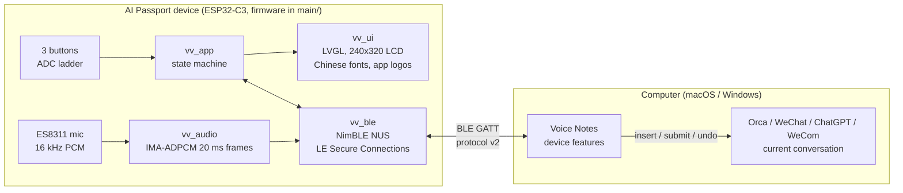

**English** · [简体中文](README.zh_CN.md)

# Vibe Voice Input

Voice input for vibe coding. Speak into a wearable FoloToy AI Passport (ESP32-C3),
and the recognized text lands in the conversation you are working in on your
computer (macOS or Windows):
an Orca terminal session running a coding agent, or the open chat in WeChat,
ChatGPT or WeCom.

- **Device firmware** (`main/`): Bluetooth LE remote with a 240×320 Chinese UI.
  It streams 16 kHz ADPCM audio while you speak and shows live text, the current
  Target and its app logo.
- **Companion**: the device features of [Voice Notes](https://github.com/SoulZhong/voice-notes) (macOS on
  Apple silicon, Windows x64). It pairs with the device, recognizes speech on
  the computer, and inserts, submits or undoes text in the Target. This
  repository keeps the firmware and the [BLE protocol](docs/vibe-voice/protocol.md),
  the one standard both sides follow.

## Controls

| Button | Idle | While dictating |
| --- | --- | --- |
| OK (click) | Start dictation | Stop and insert the text (never presses Enter) |
| DOWN | Submit (Enter) | — |
| UP | Undo the last inserted text | Cancel the dictation |
| OK (long press) | Open the picker to jump to Orca / WeChat / ChatGPT / WeCom conversations | — |
| OK (double press) | Start or stop a [Voice Notes](https://github.com/SoulZhong/voice-notes) recording | Same, without touching the dictation |

When an Orca agent session finishes its turn and waits for you, the Device shows an
**Alert** card: OK opens (wakes) that session, UP dismisses it, DOWN shows the next one.
While dictating, only a count badge appears until you are done.

The Target follows the computer's focus: whenever a supported app is frontmost it becomes
that app's current conversation; otherwise the last Target is kept. With no Target
yet, Orca's current conversation is used.

## Architecture

A Dictation flows left to right: the Device streams ADPCM audio while OK is
active, the Companion recognizes it and sends Partial Text back for the screen,
and on stop it inserts the final Segment into the Target. The Companion also
watches Orca for sessions that start waiting (Alerts) and follows the
computer's focus to update the Target. Details are in the
[BLE protocol](docs/vibe-voice/protocol.md) and [glossary](docs/vibe-voice/CONTEXT.md).

## Quick start

1. **Flash the firmware**: download `vibe-voice-input-<version>-full.bin` from
   [Releases](https://github.com/SoulZhong/vibe-voice-input/releases) and write it at `0x0`
   (`esptool.py --chip esp32c3 write_flash 0x0 vibe-voice-input-<version>-full.bin`).
   Or build it yourself (ESP-IDF 5.5.3 activated): `./tools/validate.sh`, then
   flash `build/vibe-voice-input-full.bin`. Flashing the merged image resets
   stored pairing data.
2. **Install [Voice Notes](https://github.com/SoulZhong/voice-notes/releases/latest)** on the computer
   (macOS on Apple silicon, or Windows x64), open it and grant the permissions
   it asks for.
3. **Pair**: the device shows a 6-digit passkey. On macOS type it into the
   system prompt; on Windows type it into Voice Notes.

The standalone macOS VibeVoice app is no longer maintained; quit and delete it
before using Voice Notes.

Details: [firmware](docs/vibe-voice/firmware.md) · [BLE protocol](docs/vibe-voice/protocol.md) ·
[glossary](docs/vibe-voice/CONTEXT.md).

## Development

Read [`AGENTS.md`](AGENTS.md) first. Run `./tools/validate.sh --static` while
iterating and the full `./tools/validate.sh` before delivery. Release firmware with
`./tools/release_firmware.sh` ([details](docs/vibe-voice/firmware.md#release)).
The board baseline, BSP and hardware guide come from the
upstream project and are documented under [`docs/`](docs/README.md).

## License and credits

- This project is licensed under the [GNU Affero General Public License v3.0 or
  later](LICENSE).
- It is derived from [FoloToy AI Passport](https://gitee.com/FoloToy/ai-passport),
  Copyright (c) 2026 FoloToy, released under the
  [MIT License](LICENSES/MIT-FoloToy.txt). That notice applies to the inherited code.
- The Chinese UI fonts are generated from Noto Sans SC under the SIL Open Font
  License 1.1 ([details](assets/fonts/vibe-voice/README.md)).
- Related project: [Voice Notes](https://github.com/SoulZhong/voice-notes), the
  notes app that hosts the Companion; double-press OK controls its recording.
- The app logos in `assets/icons/vibe-voice/` are trademarks of their respective
  owners, extracted from locally installed apps for identification only
  ([details](assets/icons/vibe-voice/README.md)).
