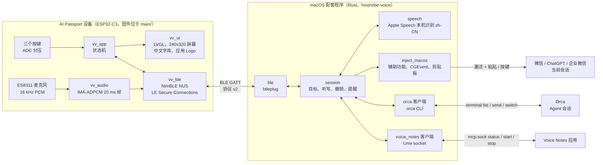

[English](README.md) · **简体中文**

# Vibe Voice Input

面向 vibe coding 的语音输入。对着佩戴的 FoloToy AI Passport（ESP32-C3）说话，识别出的文字会落到你在 Mac 上正在使用的会话里：运行编码 Agent 的 Orca 终端会话，或微信、ChatGPT、企业微信中打开的聊天。

- **设备固件**（`main/`）：蓝牙 LE 遥控器，240×320 中文界面。说话时以 16 kHz ADPCM 流式传输音频，并显示实时文字、当前目标及其应用 Logo。
- **macOS 配套程序**（`host/vibe-voice/`，Rust）：与设备配对，使用 Apple Speech 在本机流式识别（支持中英混说），并向目标插入、提交或撤销文字。

## 操作

| 按键 | 空闲 | 听写中 |
| --- | --- | --- |
| OK（单击） | 开始听写 | 结束并插入文字（从不按回车） |
| DOWN | 提交（回车） | — |
| UP | 撤销上一段插入的文字 | 取消听写 |
| OK（长按） | 打开选择页，跳转到 Orca / 微信 / ChatGPT / 企业微信的会话 | — |
| OK（双击） | 开始或停止 Mac 上的 [Voice Notes](https://github.com/SoulZhong/voice-notes) 录音 | 同左，不影响听写 |

当某个 Orca Agent 会话结束本轮工作、等待你回复时，设备弹出**提醒**卡片：OK 打开（唤醒）该会话，UP 忽略，DOWN 查看下一条。听写过程中只在顶部显示提醒数量，结束后再弹出。

目标跟随 Mac 焦点：只要最前面的是支持的应用，目标就切换为该应用的当前会话；否则保持上一个目标。尚无目标时使用 Orca 的当前会话。

## 系统架构

一次听写从左到右流动：OK 开始后设备流式发送 ADPCM 音频，配套程序送入 Apple Speech 并把临时文字回传给屏幕；结束时把最终片段插入目标（Orca 经 `orca terminal send`，其他应用经粘贴）。配套程序还会轮询 Orca 中开始等待用户的会话（提醒）、跟随 Mac 焦点更新目标，并通过本地控制 socket 驱动 Voice Notes。详见 [BLE 协议](docs/vibe-voice/protocol.zh_CN.md) 与 [术语表](docs/vibe-voice/CONTEXT.zh_CN.md)。

## 快速开始

1. **刷写固件**（已激活 ESP-IDF 5.5.3）：运行 `./tools/validate.sh`，然后把 `build/vibe-voice-input-full.bin` 写到 `0x0`。刷写合并镜像会清除已保存的配对信息。
2. **构建配套程序**：`cd host/vibe-voice && ./scripts/bundle.sh`，然后打开 `target/bundle/VibeVoice.app`，按提示授予蓝牙、语音识别和辅助功能权限。
3. **配对**：设备显示 6 位配对码，在 macOS 弹窗中输入。

详情：[配套程序 README](host/vibe-voice/README.zh_CN.md) · [固件](docs/vibe-voice/firmware.zh_CN.md) · [BLE 协议](docs/vibe-voice/protocol.zh_CN.md) · [术语表](docs/vibe-voice/CONTEXT.zh_CN.md)。

## 开发

先阅读 [`AGENTS.zh_CN.md`](AGENTS.zh_CN.md)。迭代时运行 `./tools/validate.sh --static`，交付前运行完整的 `./tools/validate.sh`；在 `host/vibe-voice` 中运行 `cargo test`。开发板基线、BSP 与硬件指南来自上游项目，见 [`docs/`](docs/README.zh_CN.md)。

## 许可与致谢

- 本项目采用 [GNU Affero 通用公共许可证 v3.0 或更高版本](LICENSE)。
- 本项目衍生自 [FoloToy AI Passport](https://gitee.com/FoloToy/ai-passport)，Copyright (c) 2026 FoloToy，以 [MIT 许可证](LICENSES/MIT-FoloToy.txt) 发布；该声明适用于继承的代码。
- 中文界面字体由 Noto Sans SC 生成，遵循 SIL Open Font License 1.1（[详情](assets/fonts/vibe-voice/README.zh_CN.md)）。
- 相关项目：[Voice Notes](https://github.com/SoulZhong/voice-notes)，双击 OK 所控制的 macOS 会议笔记应用。
- `assets/icons/vibe-voice/` 中的应用 Logo 是各自所有者的商标，从本机已安装的应用中提取，仅用于标识（[详情](assets/icons/vibe-voice/README.zh_CN.md)）。
